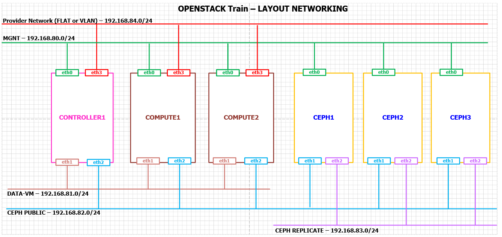
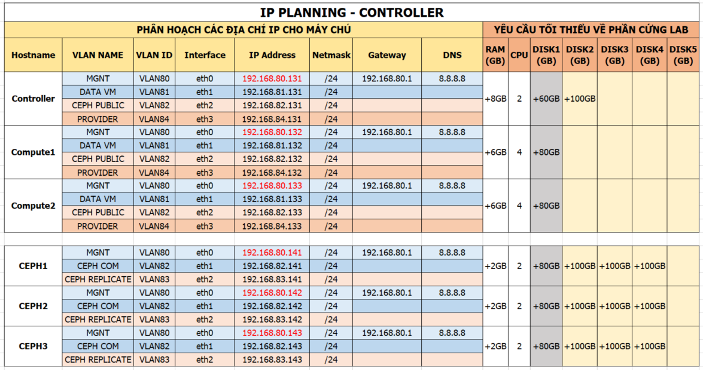

# I. Packstack dành cho mô hình OpenStack multi node.


## 1. Các bước chuẩn bị
### 1.1. Giới thiệu

- Lưu ý: Trong tài liệu này chỉ thực hiện cài đặt OpenStack, bước cài đặt CEPH ở tài liệu khác.
- Packstack là một công cụ cài đặt OpenStack nhanh chóng.
- Packstack được phát triển bởi redhat
- Chỉ hỗ trợ các distro: RHEL, CentOS.
- Tự động hóa các bước cài đặt và lựa chọn thành phần cài đặt.
- Nhanh chóng dựng được môi trường OpenStack để sử dụng làm PoC nội bộ, demo khách hàng, test tính năng.
- Nhược điểm 1 : Đóng kín các bước cài đối với người mới.
- Nhược điểm 2: Khó bug các lỗi khi cài vì đã được đóng gói cùng với các tool cài đặt tự động (puppet).


### 1.2. Môi trường thực hiện 

- Sử dụng VMware Workstation hoặc KVM để tạo các máy cài đặt OpenStack - trong hướng dẫn này sẽ tạo trên KVM.
- Distro: CentOS 7.x
- OpenStack Train
- Công cụ cài đặt: Packstack

### 1.3. Mô hình



Lưu ý:

- Trong mô hình này là mô hình gồm đầy đủ các node nhưng đối với hướng dẫn này chỉ cần có 03 node gồm: `Controller1, Compute1, Compute2`

### 1.4. IP Planning



- Lưu ý: 
  - Sử dụng đúng thứ tự các interface (NICs) của máy để cài đặt OpenStack.
  - Sử dụng đúng các dải địa chỉ IP.
	- Trong hướng dẫn này  không cần đặt IP cho eth2 vì không sử dụng CEPH.

## 2. Các bước cài đặt
### 2.1. Các bước chuẩn bị trên trên Controller

- Thiết lập hostname

```sh
hostnamectl set-hostname controller1
```

- Thiết lập IP 

```sh
echo "Setup IP eth0"
nmcli con modify eth0 ipv4.addresses 192.168.80.131/24
nmcli con modify eth0 ipv4.gateway 192.168.80.1
nmcli con modify eth0 ipv4.dns 8.8.8.8
nmcli con modify eth0 ipv4.method manual
nmcli con modify eth0 connection.autoconnect yes

echo "Setup IP eth1"
nmcli con modify eth1 ipv4.addresses 192.168.81.131/24
nmcli con modify eth1 ipv4.method manual
nmcli con modify eth1 connection.autoconnect yes

echo "Setup IP eth2"
nmcli con modify eth2 ipv4.addresses 192.168.82.131/24
nmcli con modify eth2 ipv4.method manual
nmcli con modify eth2 connection.autoconnect yes

echo "Setup IP eth3"
nmcli con modify eth3 ipv4.addresses 192.168.84.131/24
nmcli con modify eth3 ipv4.method manual
nmcli con mod eth3 connection.autoconnect yes

sudo systemctl disable firewalld
sudo systemctl stop firewalld
sudo systemctl disable NetworkManager
sudo systemctl stop NetworkManager
sudo systemctl enable network
sudo systemctl start network

sed -i 's/SELINUX=enforcing/SELINUX=disabled/g' /etc/sysconfig/selinux
sed -i 's/SELINUX=enforcing/SELINUX=disabled/g' /etc/selinux/config

echo "127.0.0.1   controller1 localhost" > /etc/hosts
echo "192.168.80.131   controller1" >> /etc/hosts
echo "192.168.80.132   compute1" >> /etc/hosts
echo "192.168.80.133   compute2" >> /etc/hosts

init 6
```
  
- Khai báo repos cho OpenStack Train

```sh
yum install -y epel-release
yum install -y centos-release-openstack-train
yum update -y

yum install -y wget crudini  byobu
yum install -y git python-setuptools
yum install -y openstack-packstack
```

- Trong Train khi sử dụng packstack để cài có thể gặp lỗi `ERROR : Failed to load plugin from file ssl_001.py`, fix theo hướng dẫn dưới (trong đoạn trên đã cài sẵn các fix rồi nhé)

```sh
https://gist.github.com/congto/36116ef868ee8fe2b2e83249710fee16
```

### 2.2. Các bước chuẩn bị trên trên Compute1

- Thiết lập hostname

```sh
hostnamectl set-hostname compute1
```

- Thiết lập IP 

```sh
echo "Setup IP eth0"
nmcli con modify eth0 ipv4.addresses 192.168.80.132/24
nmcli con modify eth0 ipv4.gateway 192.168.80.1
nmcli con modify eth0 ipv4.dns 8.8.8.8
nmcli con modify eth0 ipv4.method manual
nmcli con modify eth0 connection.autoconnect yes

echo "Setup IP eth1"
nmcli con modify eth1 ipv4.addresses 192.168.81.132/24
nmcli con modify eth1 ipv4.method manual
nmcli con modify eth1 connection.autoconnect yes

echo "Setup IP eth2"
nmcli con modify eth2 ipv4.addresses 192.168.82.132/24
nmcli con modify eth2 ipv4.method manual
nmcli con modify eth2 connection.autoconnect yes

echo "Setup IP eth3"
nmcli con modify eth3 ipv4.addresses 192.168.84.132/24
nmcli con modify eth3 ipv4.method manual
nmcli con modify eth3 connection.autoconnect yes

sudo systemctl disable firewalld
sudo systemctl stop firewalld
sudo systemctl disable NetworkManager
sudo systemctl stop NetworkManager
sudo systemctl enable network
sudo systemctl start network

sed -i 's/SELINUX=enforcing/SELINUX=disabled/g' /etc/sysconfig/selinux
sed -i 's/SELINUX=enforcing/SELINUX=disabled/g' /etc/selinux/config

echo "127.0.0.1   compute1  localhost" > /etc/hosts
echo "192.168.80.131   controller1" >> /etc/hosts
echo "192.168.80.132   compute1" >> /etc/hosts
echo "192.168.80.133   compute2" >> /etc/hosts

init 6
```

- Khai báo repos cho OpenStack Train trên node `Compute1`

```sh
yum install -y epel-release
yum install -y centos-release-openstack-train
yum update -y

yum install -y wget crudini  byobu
yum install -y git python-setuptools
yum install -y openstack-packstack
```
  
- Trong Train khi sử dụng packstack để cài có thể gặp lỗi `ERROR : Failed to load plugin from file ssl_001.py`, fix theo hướng dẫn dưới (trong đoạn trên đã cài sẵn các fix rồi nhé)
```sh
https://gist.github.com/congto/36116ef868ee8fe2b2e83249710fee16
```

### 2.3. Các bước chuẩn bị trên trên Compute2

- Thiết lập hostname

```sh
hostnamectl set-hostname compute2
```

- Thiết lập IP 

```sh
echo "Setup IP eth0"
nmcli con modify eth0 ipv4.addresses 192.168.80.133/24
nmcli con modify eth0 ipv4.gateway 192.168.80.1
nmcli con modify eth0 ipv4.dns 8.8.8.8
nmcli con modify eth0 ipv4.method manual
nmcli con modify eth0 connection.autoconnect yes

echo "Setup IP eth1"
nmcli con modify eth1 ipv4.addresses 192.168.81.133/24
nmcli con modify eth1 ipv4.method manual
nmcli con modify eth1 connection.autoconnect yes

echo "Setup IP eth2"
nmcli con modify eth2 ipv4.addresses 192.168.82.133/24
nmcli con modify eth2 ipv4.method manual
nmcli con modify eth2 connection.autoconnect yes

echo "Setup IP eth3"
nmcli con modify eth3 ipv4.addresses 192.168.84.133/24
nmcli con modify eth3 ipv4.method manual
nmcli con modify eth3 connection.autoconnect yes

sudo systemctl disable firewalld
sudo systemctl stop firewalld
sudo systemctl disable NetworkManager
sudo systemctl stop NetworkManager
sudo systemctl enable network
sudo systemctl start network

sed -i 's/SELINUX=enforcing/SELINUX=disabled/g' /etc/sysconfig/selinux
sed -i 's/SELINUX=enforcing/SELINUX=disabled/g' /etc/selinux/config

echo "127.0.0.1   compute2  localhost" > /etc/hosts
echo "192.168.80.131   controller1" >> /etc/hosts
echo "192.168.80.132   compute1" >> /etc/hosts
echo "192.168.80.133   compute2" >> /etc/hosts

init 6

```

- Khai báo repos cho OpenStack Train trên node `Compute2`

```sh
yum install -y epel-release
yum install -y centos-release-openstack-train
yum update -y

yum install -y wget crudini  byobu
yum install -y git python-setuptools
yum install -y openstack-packstack
```

- Trong Train khi sử dụng packstack để cài có thể gặp lỗi `ERROR : Failed to load plugin from file ssl_001.py`, fix theo hướng dẫn dưới (trong đoạn trên đã cài sẵn các fix rồi nhé)

	```sh
	https://gist.github.com/congto/36116ef868ee8fe2b2e83249710fee16
	```

### 3. Cài đặt OpenStack Train
#### 3.1. Chuẩn bị file trả lời cho packstack
- Đứng trên controller để thực hiện các bước sau
- Gõ lệnh dưới 
  ```sh
  byobu
  ```

- Tạo file trả lời để cài packstack
  ```sh
  packstack --gen-answer-file=/root/rdotraloi.txt \
    --allinone \
    --default-password=Welcome123 \
    --os-cinder-install=y \
    --os-ceilometer-install=n \
    --os-trove-install=n \
    --os-ironic-install=n \
    --os-swift-install=n \
    --os-panko-install=n \
    --os-heat-install=n \
    --os-magnum-install=n \
    --os-aodh-install=n \
    --os-neutron-ovs-bridge-mappings=extnet:br-ex \
    --os-neutron-ovs-bridge-interfaces=br-ex:eth3 \
    --os-neutron-ovs-bridges-compute=br-ex \
    --os-neutron-l2-agent=openvswitch \
    --os-neutron-ml2-type-drivers=vxlan,flat \
    --os-neutron-ml2-tenant-network-types=vxlan \
    --os-controller-host=192.168.80.131 \
    --os-compute-hosts=192.168.80.132,192.168.80.133 \
    --provision-demo=n
  ```


- Thực thi file trả lời vừa tạo ở trên (nếu cần có thể mở ra để chỉnh lại các tham số cần thiết.

  ```sh
  packstack --answer-file rdotraloi.txt
  ```
  
- Nhập mật khẩu đăng nhập ssh của tài khoản root khi được yêu cầu.

- Chờ để packstack cài đặt xong.

Nếu xuất hiện thông báo lỗi dưới khi chạy lệnh packstack thì thực hiện lệnh sau để fix `yum downgrade -y leatherman`. Tham khảo: https://bugs.launchpad.net/tripleo/+bug/1845274

```
[root@controller1 ~]# packstack --answer-file rdotraloi.txt
Welcome to the Packstack setup utility

The installation log file is available at: /var/tmp/packstack/20200225-165221-lPGSAC/openstack-setup.log

Installing:
Clean Up                                             [ DONE ]
Discovering ip protocol version                      [ DONE ]
Setting up ssh keys                                  [ DONE ]
Preparing servers                                    [ DONE ]
Pre installing Puppet and discovering hosts' details[ ERROR ]

ERROR : Failed to run remote script, stdout:
stderr: Warning: Permanently added '192.168.80.131' (ECDSA) to the list of known hosts.
+ trap t ERR
+ facter -p
facter: error while loading shared libraries: leatherman_curl.so.1.3.0: cannot open shared object file: No such file or directory
++ t
++ exit 127

```

Sau đó mới chạy lệnh `packstack --answer-file rdotraloi.txt` 

####  3.2. Kiểm tra hoạt động của OpenStack sau khi cài 

- Sau khi cài đặt xong, màn hình sẽ hiển thị thông báo như dưới

```sh
 **** Installation completed successfully ******

Additional information:
 * File /root/keystonerc_admin has been created on OpenStack client host 192.168.80.131. To use the command line tools you need to source the file.
 * To access the OpenStack Dashboard browse to http://192.168.80.131/dashboard .
Please, find your login credentials stored in the keystonerc_admin in your home directory.
 * Because of the kernel update the host 192.168.80.131 requires reboot.
 * Because of the kernel update the host 192.168.80.133 requires reboot.
 * Because of the kernel update the host 192.168.80.132 requires reboot.
 * The installation log file is available at: /var/tmp/packstack/20190609-151702-MVmefX/openstack-setup.log
 * The generated manifests are available at: /var/tmp/packstack/20190609-151702-MVmefX/manifests
```

- Đứng trên `Controller1` thực hiện lệnh dưới để sửa các cấu hình cần thiết.

```sh
sed -i -e 's/enable_isolated_metadata=False/enable_isolated_metadata=True/g' /etc/neutron/dhcp_agent.ini

ssh -o StrictHostKeyChecking=no root@192.168.80.132 "sed -i -e 's/compute1/192.168.80.132/g' /etc/nova/nova.conf"

ssh -o StrictHostKeyChecking=no root@192.168.80.133 "sed -i -e 's/compute2/192.168.80.133/g' /etc/nova/nova.conf"
```

- Tắt Iptables trên cả 03 node 

```sh 
systemctl stop iptables
systemctl disable iptables

ssh -o StrictHostKeyChecking=no root@192.168.80.132 "systemctl stop iptables"
ssh -o StrictHostKeyChecking=no root@192.168.80.132 "systemctl disable iptables"

ssh -o StrictHostKeyChecking=no root@192.168.80.133 "systemctl stop iptables"
ssh -o StrictHostKeyChecking=no root@192.168.80.133 "systemctl disable iptables"
```
  
- Khởi động lại cả 03 node `Controller1, Compute1, Compute2`.

```sh
ssh -o StrictHostKeyChecking=no root@192.168.80.132 "init 6"

ssh -o StrictHostKeyChecking=no root@192.168.80.133 "init 6"

init 6
```

- Đăng nhập lại vào `Controller1` bằng quyền `root` và kiểm tra hoạt động của openstack sau khi cài.

- Khai báo biến môi trường

```sh
source keystonerc_admin
```

- Kiểm tra hoạt động của openstack bằng lệnh dưới (`lưu ý: có thể phải mất vài phút để các service của OpenStack khởi động xong`).

```sh
openstack token issue
```
    
- Kết quả lệnh trên như sau:

```sh
+------------+-----------------------------------------------------------------------------------------------------------------------------------------------------------------------------------------+
| Field      | Value                                                                                                                                                                                   |
+------------+-----------------------------------------------------------------------------------------------------------------------------------------------------------------------------------------+
| expires    | 2017-09-17T14:46:54+0000                                                                                                                                                                |
| id         | gAAAAABZvnzOyW6-0gJLN5_ZG5zRpj932wYO5EgfvTWdJzU6HYxI1UpAl5_EHvSpU4pA5KWWHzVQkmKBKx0Pex8ZVxcSdBZGCDiJYrNCOd--0fqi80MBQzQuAH7ODATgR2-ZM7Or41Rq1M4dwC1rTLLWoqtiHuY2qJus9OUapJwbDfAivWHYCAk |
| project_id | 2f8619d1fea2465cbe302eb74ed10d2e                                                                                                                                                        |
| user_id    | 4487225f20454467bf89e21c1a04e921                                                                                                                                                        |
+------------+-----------------------------------------------------------------------------------------------------------------------------------------------------------------------------------------+
```

- Ngoài ra có thể kiểm tra thêm bằng cách lệnh khác: `openstack user list` ,  `openstack service list`, `openstack catalog list`

### 4. Tạo images, network, subnet, router, mở security group và tạo VM.
- Bước này có thể tạo bằng GUI hoặc bằng CLI
- Link truy cập vào web GUI là: 192.168.80.131. Đăng nhập với tài khoản là `admin`, mật khẩu là `Welcome123`

#### 4.1. Tạo images
- Đăng nhập vào node controller1 với quyền root và thực thi các lệnh sau
- Tải images cirros. Images này dùng để tạo các máy ảo sau này: 

```sh
wget http://download.cirros-cloud.net/0.3.5/cirros-0.3.5-x86_64-disk.img
```

- Tạo images 

```sh
source keystonerc_admin

openstack image create "cirros" \
	--file cirros-0.3.5-x86_64-disk.img \
	--disk-format qcow2 --container-format bare \
	--public
```

- Kiểm tra việc tạo images, kết quả như dưới là thành công. Nếu không có kết quả này thì chịu khó làm lại hoặc đọc log :) 

```sh
openstack image list
```

- Kết quả ta có, lưu ý trường ID để sử dụng cho bước tạo VM ở dưới.

```
[root@controller1 ~(keystone_admin)]# openstack image list
+--------------------------------------+--------+--------+
| ID                                   | Name   | Status |
+--------------------------------------+--------+--------+
| 8cce7578-f888-416e-af42-5461600e8dfe | cirros | active |
+--------------------------------------+--------+--------+
```

#### 4.2. Tạo network

##### 4.2.1. Tạo provider network 

- Tạo provider network 

```sh 
openstack network create  --share --external \
	--provider-physical-network extnet \
	--provider-network-type flat net-provider
```


	
- Taoh subnet cho provider network

```sh
openstack subnet create --network net-provider \
	--allocation-pool start=192.168.84.201,end=192.168.84.219 \
	--dns-nameserver 8.8.8.8 --gateway 192.168.84.1 \
	--subnet-range 192.168.84.0/24 sub-net-provider	
```

##### 4.2.2. Tạo private network 
	
- Tạo private network 

```sh
openstack network create net-selfservice
```

- Tạo subnet cho private network 

```sh 
openstack subnet create --network net-selfservice \
	--dns-nameserver 8.8.4.4 --gateway 172.199.1.1 \
	--subnet-range 172.199.1.0/24 sub-net-selfservice
```	

##### 4.2.3. Tạo router

- Tạo router 

```sh
openstack router create R1
```

- Gắn các private network vào Router, lệnh này ko hiển thị ra kết quả. Lưu ý điền đúng tên subnet private là `sub-net-selfservice` và tên của router là R1.

```sh 
openstack router add subnet R1 sub-net-selfservice
```

- Gắn gateway cho router, bước này cũng cần điền đúng tên của network provider được tạo ở trên, đó là `net-provider`  và  và tên của router là R1.

```sh
openstack router set R1 --external-gateway net-provider	
```

##### 4.3 Kiểm tra lại các bước thiết lập về network 


- Kiểm tra các agent của router và dhcp trên neutron bằng lệnh `ip netns`. Kết quả là: 

```sh
root@controller1 ~(keystone_admin)]# ip netns
qrouter-4b831df7-470e-4be3-8775-56f2de9897cb (id: 2)
qdhcp-0daa313c-2ea0-4be2-9d7f-546a2ae45715 (id: 1)
qdhcp-4ac074cc-7055-4fb8-a101-aaba14b6cff4 (id: 0)
```
	
- Kiểm tra các port của router R1

```sh
openstack port list --router R1
```

- Kết quả là: 

```sh
+--------------------------------------+------+-------------------+-------------------------------------------------------------------------------+--------+
| ID                                   | Name | MAC Address       | Fixed IP Addresses                                                            | Status |
+--------------------------------------+------+-------------------+-------------------------------------------------------------------------------+--------+
| c05caaed-5712-426e-8a3f-4e5bf9e5cd7c |      | fa:16:3e:4e:7a:b6 | ip_address='172.199.1.1', subnet_id='952a4b55-b6a5-4359-a758-be676e0a365a'    | ACTIVE |
| f21af1b2-b58c-4d12-a5cf-d83623fc6d2c |      | fa:16:3e:51:02:92 | ip_address='192.168.84.219', subnet_id='e8e0a0f5-5df2-42f2-b030-fd063f8ec140' | ACTIVE |
+--------------------------------------+------+-------------------+-------------------------------------------------------------------------------+--------+
```

- Lưu ý trong kết quả lệnh trên, ta sẽ thấy IP thuộc VLAN `192.168.84.0/24` là `192.168.84.219`. Đây chính là IP của router, nếu đứng từ máy bạn có thể ping tới IP này thì chứng tỏ việc thiết lập network đã thành công.

```sh
C:\Users\congto>ping 192.168.84.219

Pinging 192.168.84.219 with 32 bytes of data:
Reply from 192.168.84.219: bytes=32 time=17ms TTL=63
Reply from 192.168.84.219: bytes=32 time=15ms TTL=63
Reply from 192.168.84.219: bytes=32 time=16ms TTL=63
Reply from 192.168.84.219: bytes=32 time=15ms TTL=63

Ping statistics for 192.168.84.219:
		Packets: Sent = 4, Received = 4, Lost = 0 (0% loss),
Approximate round trip times in milli-seconds:
		Minimum = 15ms, Maximum = 17ms, Average = 15ms
```

##### 4.4. Mở các rule về security group

- Thực hiện mở các rule để có thể truy cập từ ngoài vào VM sau khi tạo xong VM ở các bước tiếp theo.

```sh
openstack security group rule create --proto icmp default
openstack security group rule create --proto tcp --dst-port 22 default
```

##### 4.5. Tạo VM	

Cách 1: Truy cập vào dashboard ở địa chỉ http://192.168.80.131 để tạo VM.

Cách 2: Sử dụng lệnh dưới để tạo VM.

- Kiểm tra image đang có trên hệ thống bằng lệnh `openstack image list `. Lưu lại ID của image cần sử dụng để tạo VM ở bước tiếp theo. 

```
[root@controller1 ~(keystone_admin)]# openstack image list
+--------------------------------------+--------+--------+
| ID                                   | Name   | Status |
+--------------------------------------+--------+--------+
| 8cce7578-f888-416e-af42-5461600e8dfe | cirros | active |
+--------------------------------------+--------+--------+
```

- Kiểm tra các network đã khai báo ở trên bằng lệnh `openstack network list`, lưu lại ID của network provider hoặc selfservice để dùng cho bước tạo VM ở dưới.

```
[root@controller1 ~(keystone_admin)]# openstack network list
+--------------------------------------+-----------------+--------------------------------------+
| ID                                   | Name            | Subnets                              |
+--------------------------------------+-----------------+--------------------------------------+
| be4e15bc-9f99-456b-a2f3-f6763915e2f8 | net-selfservice | fa683d3c-e76b-4367-b220-e823adb3667b |
| e4c17f0c-3827-4cb5-80ce-fbbe8231b797 | net-provider    | 77317fd5-5432-4abd-8bcd-ed28ee81e466 |
+--------------------------------------+-----------------+--------------------------------------+
```

- Kiểm tra security group đang có trên hệ thống bằng lệnh `openstack security group list`. Ta lưu lại ID của security group để khai báo trong bước tạo máy ảo.

```
[root@controller1 ~(keystone_admin)]# openstack security group list
+--------------------------------------+---------+------------------------+----------------------------------+------+
| ID                                   | Name    | Description            | Project                          | Tags |
+--------------------------------------+---------+------------------------+----------------------------------+------+
| 8223ba89-0ba1-4f44-a9ca-46d281e775e3 | default | Default security group | 81bf2058bac74ce7978f76c609acc1d1 | []   |
+--------------------------------------+---------+------------------------+----------------------------------+------+
```

- Kiểm tra các gói cấu hình bằng lệnh `openstack flavor list`, kết quả trả về các flavor (gói cấu hình). Lưu lại tên gói cấu hình để sử dụng cho bước tạo VM.

```
[root@controller1 ~(keystone_admin)]# openstack flavor list
+----+-----------+-------+------+-----------+-------+-----------+
| ID | Name      |   RAM | Disk | Ephemeral | VCPUs | Is Public |
+----+-----------+-------+------+-----------+-------+-----------+
| 1  | m1.tiny   |   512 |    1 |         0 |     1 | True      |
| 2  | m1.small  |  2048 |   20 |         0 |     1 | True      |
| 3  | m1.medium |  4096 |   40 |         0 |     2 | True      |
| 4  | m1.large  |  8192 |   80 |         0 |     4 | True      |
| 5  | m1.xlarge | 16384 |  160 |         0 |     8 | True      |
+----+-----------+-------+------+-----------+-------+-----------+
```

- Tạo máy ảo theo cú pháp

```
 openstack server create Ten_may_ao --flavor ten_flavor --image ten_image \
 	--nic net-id=ID_cua_network --security-group ID_cua_security_group
```

Thay các ID và tên ở bước trên, ta tạo máy ảo bằng lệnh dưới: 

```
openstack server create Provider_VM01 --flavor m1.tiny --image cirros \
--nic net-id=e4c17f0c-3827-4cb5-80ce-fbbe8231b797  --security-group 8223ba89-0ba1-4f44-a9ca-46d281e775e3
```

- Ta có kết quả trả về

```
+-------------------------------------+-----------------------------------------------+
| Field                               | Value                                         |
+-------------------------------------+-----------------------------------------------+
| OS-DCF:diskConfig                   | MANUAL                                        |
| OS-EXT-AZ:availability_zone         |                                               |
| OS-EXT-SRV-ATTR:host                | None                                          |
| OS-EXT-SRV-ATTR:hypervisor_hostname | None                                          |
| OS-EXT-SRV-ATTR:instance_name       |                                               |
| OS-EXT-STS:power_state              | NOSTATE                                       |
| OS-EXT-STS:task_state               | scheduling                                    |
| OS-EXT-STS:vm_state                 | building                                      |
| OS-SRV-USG:launched_at              | None                                          |
| OS-SRV-USG:terminated_at            | None                                          |
| accessIPv4                          |                                               |
| accessIPv6                          |                                               |
| addresses                           |                                               |
| adminPass                           | 8jZMuygEF8Vq                                  |
| config_drive                        |                                               |
| created                             | 2020-02-25T08:38:47Z                          |
| flavor                              | m1.tiny (1)                                   |
| hostId                              |                                               |
| id                                  | 43074d78-ae03-45d8-8232-fe52e104bc06          |
| image                               | cirros (8cce7578-f888-416e-af42-5461600e8dfe) |
| key_name                            | None                                          |
| name                                | Provider_VM01                                 |
| progress                            | 0                                             |
| project_id                          | 81bf2058bac74ce7978f76c609acc1d1              |
| properties                          |                                               |
| security_groups                     | name='8223ba89-0ba1-4f44-a9ca-46d281e775e3'   |
| status                              | BUILD                                         |
| updated                             | 2020-02-25T08:38:47Z                          |
| user_id                             | 57918e11cadb495ba8cb86419c649a01              |
| volumes_attached                    |                                               |
+-------------------------------------+-----------------------------------------------+
```

- Chờ từ 1-2 phút, ta kiểm tra danh sách các máy ảo bằng lệnh `openstack server list`, kết quả trả về sẽ có dạng như dưới.

```
[root@controller1 ~(keystone_admin)]# openstack server list
+--------------------------------------+---------------+--------+-----------------------------+--------+---------+
| ID                                   | Name          | Status | Networks                    | Image  | Flavor  |
+--------------------------------------+---------------+--------+-----------------------------+--------+---------+
| 43074d78-ae03-45d8-8232-fe52e104bc06 | Provider_VM01 | ACTIVE | net-provider=192.168.84.209 | cirros | m1.tiny |
+--------------------------------------+---------------+--------+-----------------------------+--------+---------+
```

- Thử ping tới địa chỉ 192.168.84.209, ta có kết quả như bên dưới

```
[root@controller1 ~(keystone_admin)]# ping 192.168.84.209
PING 192.168.84.209 (192.168.84.209) 56(84) bytes of data.
64 bytes from 192.168.84.209: icmp_seq=1 ttl=64 time=14.4 ms
64 bytes from 192.168.84.209: icmp_seq=2 ttl=64 time=1.36 ms
^C
--- 192.168.84.209 ping statistics ---
2 packets transmitted, 2 received, 0% packet loss, time 1001ms
rtt min/avg/max/mdev = 1.364/7.906/14.449/6.543 ms
```

- Đứng tại controller thực hiện lệnh `ssh cirros@192.168.84.209` hoặc dùng tool để ssh tới máy ảo vừa tạo với usename là `cirros` và mật khẩu là gocubgo

```
ssh cirros@192.168.84.209
```

- Sau khi đăng nhập vào máy ảo thành công, thực hiện kiểm tra IP và các lệnh ping cơ bản để kiểm tra kết nối, ta có kết quả như sau:

```
$ ip a
1: lo: <LOOPBACK,UP,LOWER_UP> mtu 16436 qdisc noqueue
    link/loopback 00:00:00:00:00:00 brd 00:00:00:00:00:00
    inet 127.0.0.1/8 scope host lo
    inet6 ::1/128 scope host
       valid_lft forever preferred_lft forever
2: eth0: <BROADCAST,MULTICAST,UP,LOWER_UP> mtu 1500 qdisc pfifo_fast qlen 1000
    link/ether fa:16:3e:98:c1:51 brd ff:ff:ff:ff:ff:ff
    inet 192.168.84.209/24 brd 192.168.84.255 scope global eth0
    inet6 fe80::f816:3eff:fe98:c151/64 scope link
       valid_lft forever preferred_lft forever
$ ping google.com
PING google.com (216.58.200.14): 56 data bytes
64 bytes from 216.58.200.14: seq=0 ttl=51 time=23.550 ms
64 bytes from 216.58.200.14: seq=1 ttl=51 time=25.105 ms
^C
--- google.com ping statistics ---
2 packets transmitted, 2 packets received, 0% packet loss
round-trip min/avg/max = 23.550/24.327/25.105 ms
$ ping 8.8.8.8
PING 8.8.8.8 (8.8.8.8): 56 data bytes
64 bytes from 8.8.8.8: seq=0 ttl=51 time=20.923 ms
64 bytes from 8.8.8.8: seq=1 ttl=51 time=21.044 ms
64 bytes from 8.8.8.8: seq=2 ttl=51 time=21.095 ms
^C
--- 8.8.8.8 ping statistics ---
3 packets transmitted, 3 packets received, 0% packet loss
round-trip min/avg/max = 20.923/21.020/21.095 ms
$
```

# II. Packstack dành cho mô hình OpenStack All in one

## Yêu cầu 

Chuẩn bị mộ máy chủ trên môi trường ảo hóa hoặc vật lý với cấu hình như sau:

- CPU: +04 vCPU
- RAM: +08 GB
- Disk: +60 GB
- eth0: IP `192.168.80.125/24`, gateway 192.168.80.1. Đường kết nối dành cho API.
- eth1: IP `192.168.81.125/24`, không đặt gateway. Đường kết nối dành cho VM truyền thông với nhau.
- eth2: IP `192.168.84.125/24`, không đặt gateway. Đường kết nối để VM đi ra ngoài internet và ngước lại.

## Thực hiện

- Thiết lập hostname 
```
hostnamectl set-hostname openstackaio
```

- Thiết lập IP và cấu hình cơ bản
```
echo "Setup IP  eth0"
nmcli con modify eth0 ipv4.addresses 192.168.80.125/24
nmcli con modify eth0 ipv4.gateway 192.168.80.1
nmcli con modify eth0 ipv4.dns 8.8.8.8
nmcli con modify eth0 ipv4.method manual
nmcli con modify eth0 connection.autoconnect yes

echo "Setup IP  eth1"
nmcli con modify eth1 ipv4.addresses 192.168.81.125/24
nmcli con modify eth1 ipv4.method manual
nmcli con modify eth1 connection.autoconnect yes

echo "Setup IP  eth2"
nmcli con modify eth2 ipv4.addresses 192.168.84.125/24
nmcli con modify eth2 ipv4.method manual
nmcli con modify eth2 connection.autoconnect yes

sudo systemctl disable firewalld
sudo systemctl stop firewalld
sudo systemctl disable NetworkManager
sudo systemctl stop NetworkManager
sudo systemctl enable network
sudo systemctl start network

sed -i 's/SELINUX=enforcing/SELINUX=disabled/g' /etc/sysconfig/selinux
sed -i 's/SELINUX=enforcing/SELINUX=disabled/g' /etc/selinux/config

echo "127.0.0.1   openstackaio localhost" > /etc/hosts
echo "192.168.80.125   openstackaio" >> /etc/hosts
init 6
```

- Khai báo repos cho OpenStack Train

```
yum install -y epel-release
yum install -y centos-release-openstack-train
yum update -y

yum install -y wget crudini  byobu
yum install -y git python-setuptools
yum install -y openstack-packstack
```

- Sử dụng byobu để giữ phiên làm việc

```
byobu
```	

- Tạo file answer để chuẩn bị cài đặt OpenStack. Trong file này sử dụng `openvswitch`. 

```
packstack --gen-answer-file=/root/rdotraloi.txt \
	--allinone \
	--default-password=Welcome123 \
	--os-cinder-install=y \
	--os-ceilometer-install=n \
	--os-trove-install=n \
	--os-ironic-install=n \
	--os-swift-install=n \
	--os-panko-install=n \
	--os-heat-install=n \
	--os-magnum-install=n \
	--os-aodh-install=n \
	--os-neutron-ovs-bridge-mappings=extnet:br-ex \
	--os-neutron-ovs-bridge-interfaces=br-ex:eth2 \
	--os-neutron-ovs-bridges-compute=br-ex \
	--os-neutron-ml2-mechanism-drivers=openvswitch \
	--os-neutron-l2-agent=openvswitch \
	--os-neutron-ml2-type-drivers=vxlan,flat \
	--os-neutron-ml2-tenant-network-types=vxlan \
	--provision-demo=n
```

Nếu muốn dùng linuxbridge thì tham khảo lệnh ở link này để tạo file trả lời cho packstack, [Link tại đây](https://gist.github.com/congto/e999aa051a7c59df7fda3ceb54f6b138 )

	
- Nội dung của file trả lời sẽ có dạng như kết quả của lệnh `cat /root/rdotraloi.txt | egrep -v '^#|^$'`

- Tiến hành cài đặt OpenStack

```
packstack --answer-file rdotraloi.txt
```